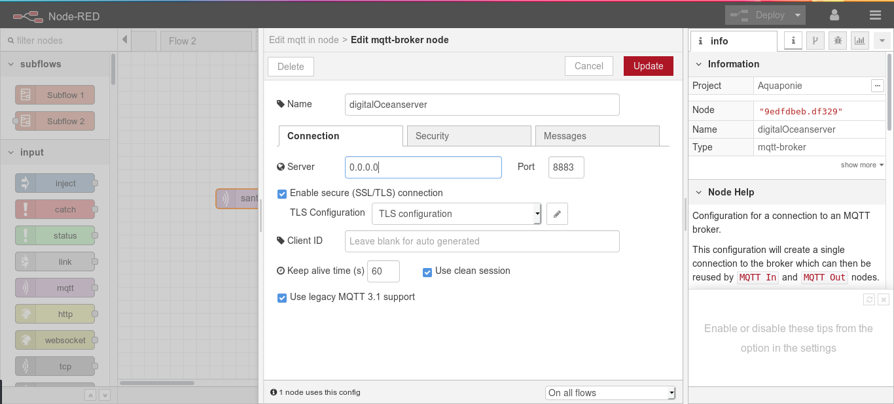
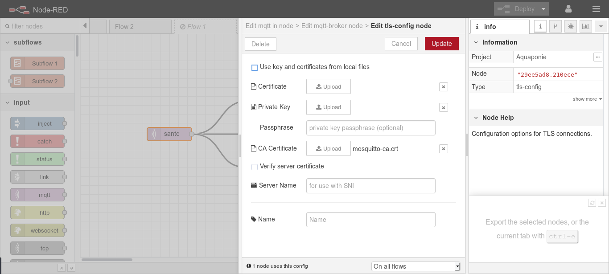

# Mqtt broken with Eclipse-Mosquitto

this repository allow you to create a broken mqtt with ssl security on Docker 

for build dockerfile you need to create ssl file, let's go 

----
### requirement
- [x] Cloud server or computer work with linux system 
- [x] Docker 
- [x] network connection (Lol!) 😂

----
### Step one : Create ssl file 
- 1 = download git repository [link](https://github.com/Diallomm/Brokenmqtt/archive/master.zip)
- 2 = Go to "certs" on repository folder and create ssl file 
	cd BrokenMqtt/certs 

	openssl genrsa -des3 -out mosquitto-ca.key 2048

	openssl req -new -x509 -days 3650 -key mosquitto-ca.key -out mosquitto-ca.crt (Answer all question | don't copy the bracket part)
	
	openssl genrsa -out mosquitto-server.key 2048	
	
	openssl req -new -out mosquitto-server.csr -key mosquitto-server.key (Answer all question | don't copy the bracket part)

### step two : creer docker images 
run command for builder images

	docker build . -t ssl_mosquitto_broken:latest	("ssl_mosquitto_broken" is a name of images you can change it | don't copy the bracket part) 

wait for building, normally all is good after building 

### step three : creer docker container 
run command for create container
 
	docker run -itd --name broken -p 8883:8883 ssl_mosquitto_broken

normally if your type "docker ps" you can see you container run at ports 0.0.0.0:8883->8883/tcp if you can't see it you have a problem.
to connect on broken you need add Ca cerficate "mosquitto-ca.crt" on configuration client  
you can use your broken on your application for exemple with Node-red

 

### step four (optional): enable login with username and password
run command for entered 

	docker exec -it broken bash
	
	mosquitto_passwd -c /etc/mosquitto/pwfile <username>	(replace <username> by your username | don't copy the bracket part)

modify mosquitto configuration 
	vim /etc/mosquitto/mosquitto.conf

add this inside just before  "include_dir /etc/mosquitto/conf.d"

	password_file /etc/mosquitto/pwfile
	allow_anonymous false

run command exit and reboot
	exit
	
	docker restart broken 
----

## The end the moment | coming soon for next

All contribution is welcome.
 
by Diallomm [Email](misterdiallo1@gmail.com) 
